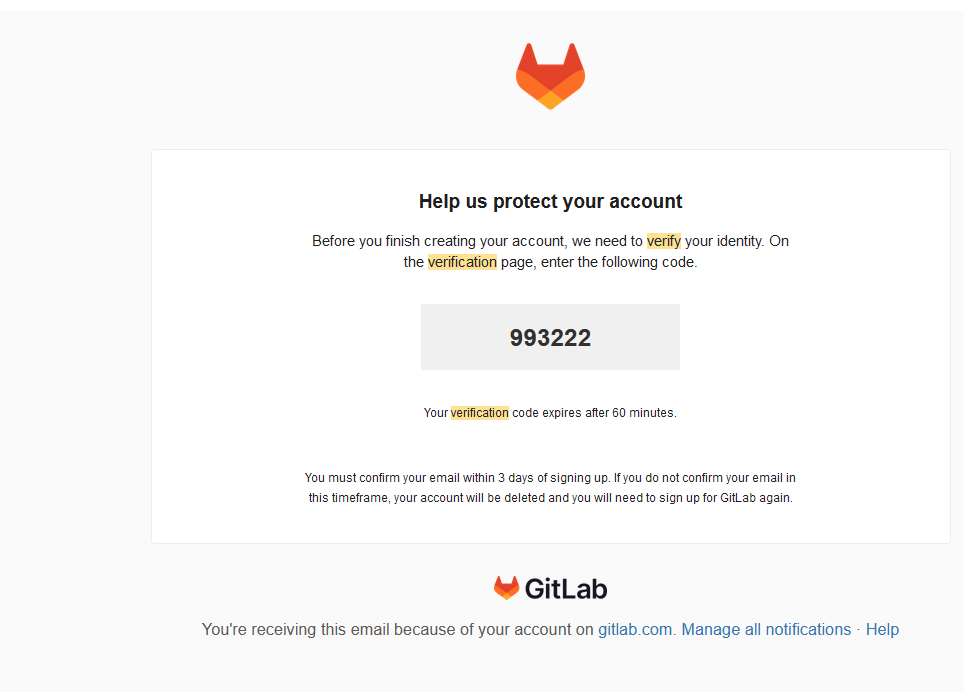

User
1. POST /api/users/register - dONE
2. POST /api/users/login - dONE
3. PATCH /api/users/updateProfile - dONE (iMPROVEMENT nEEDED)
4. DELETE /api/users/deleteUser - Done
5. PATCH /api/users/logoutUser - dONE
6. POST /api/users/refreshAccessToken - Done
7. POST /api/users/resetPassword - Done
8. GET /api/users/getCurrentUser - is /me - done
9. PATCH /api/users/updateProfilePic -Done
10. POST /api/users/verify-email  - while go with otp based varification, AWS SES, AWS SDK
11. POST /api/users/forgot-password - https://gitlab.com/users/password/edit?reset_password_token=h96DcoxQaxoSNZAmNQAX, Link based forgot password
12. GET /api/users/bookmarks
13. GET /api/users/activity
14. GET /api/users/search?q=...... search user by username, name, id

Blog
1. POST /api/blogs
2. DELETE /api/blogs/:id
3. PATCH /api/blogs/:id
4. PATCH /api/blog/:id/publish - publishBlog
5. GET /api/blogs/search?q=...... -  blog by title, author, content (Use Search Params)
6. GET /api/blogs - get all the blogs
7. GET /api/blogs/:id - get specific blog
8. POST /api/blogs/:id/bookmark - bookmark a blog
9. POST /api/blogs/:id/link - like a blog
10. POST /api/blogs/comments/:id/link - like a comment
11. POST /api/blogs/:id/comments - post a comment, reply to comment
12. GET /api/blogs/:id/comments - get all comments
13. PATCH /api/blogs/:id/unpublish
14. PATCH /api/blogs/:id/thumbnail
15. GET /api/blogs/drafts
16. POST /api/blogs/save-draft
17. GET /api/blogs?tag=tech
18. CRON JOB to notify subscriber of new blog publish from user

Todo
1. GET /api/todos
2. POST /api/todos - CreateTodo
3. DELETE /api/todos/:id - DeleteTodo
4. PATCH /api/todos/:id - UpdateTodo
5. GET /api/todos/:id - getTodobyID
6. GET /api/todos/search?q=........  - search todo by title or content (Use Search Params)
7. GET /api/todos?priority=high&sortBy=deadline - filter/sort todo by priority, deadline, category, last updated, created, user (Use Query Params)
8. PATCH /api/todos/:id/toggle-complete
9. PATCH /api/todos/:id/reminder
10. PATCH /api/todos/:id/archive
11. GET /api/todos?status=completed 

Finance
1. GET /api/finance/transactions/:id - get transaction by id
2. POST /api/finance/transactions - Create transaction
3. PATCH /api/finance/transactions/:id - Update transaction
4. DELETE /api/finance/transactions/:id - Delete transaction
5. GET /api/finance/transactions?month=....&Catrgory=...... - Filter and get transaction by month, quarter, year, category
6. GET /api/finance/transactions?month=....  - Generate monthly report and mail 
7. Send notification to enter daily transaction (Cron job/scheduler)
8. POST /api/finance/transaction/import - Feature to load CSV with transaction data
9. GET /api/finance/transactions/export?format=csv|xlsx
10. POST /api/finance/transactions/recurring
11. GET /api/finance/summary?month=...
12. GET /api/finance/categories
13. POST /api/finance/categories
14. PATCH /api/finance/categories
15. DELETE /api/finance/categories

Resume
1. POST api/resume/education - add education, certification, experience, project, etc details
2. POST api/resume/certification
3. POST api/resume/experience
4. POST api/resume/project
5. POST api/resume/skills
6. DELETE api/resume/education 
7. DELETE api/resume/certification
8. DELETE api/resume/experience
9. DELETE api/resume/project
10. PATCH api/resume/skills  
11. PATCH api/resume/education 
12. PATCH api/resume/certification
13. PATCH api/resume/experience
14. PATCH api/resume/project
15. PATCH api/resume/skills  
16. GET api/resume - get all the data about a user
17. GET api/resume/:SECTION  - get specific data about a user
18. GET /api/resume/preview
19. GET /api/resume/export?format=pdf|docx
20. POST /api/resume/upload

Github

Spotify

integrating password login with oauth login:
1. 

